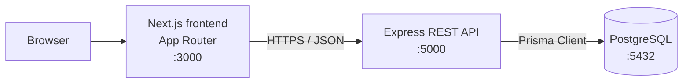
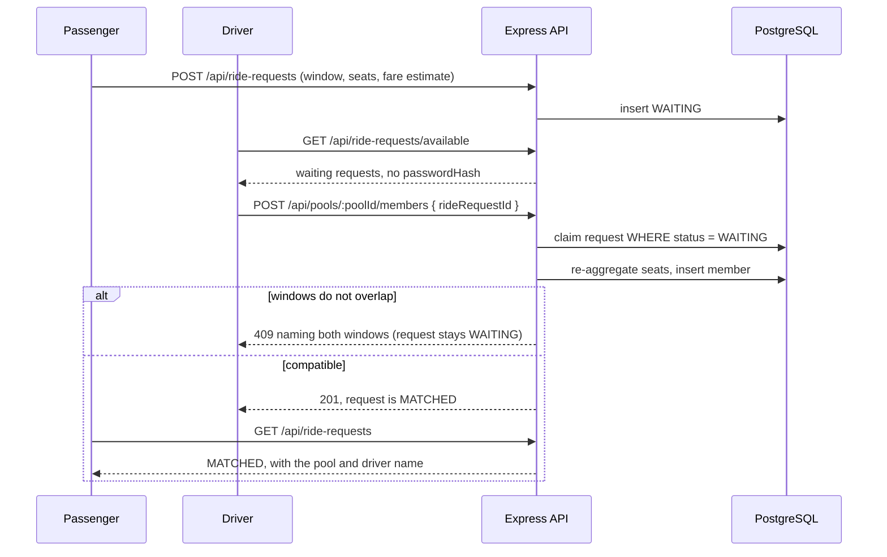
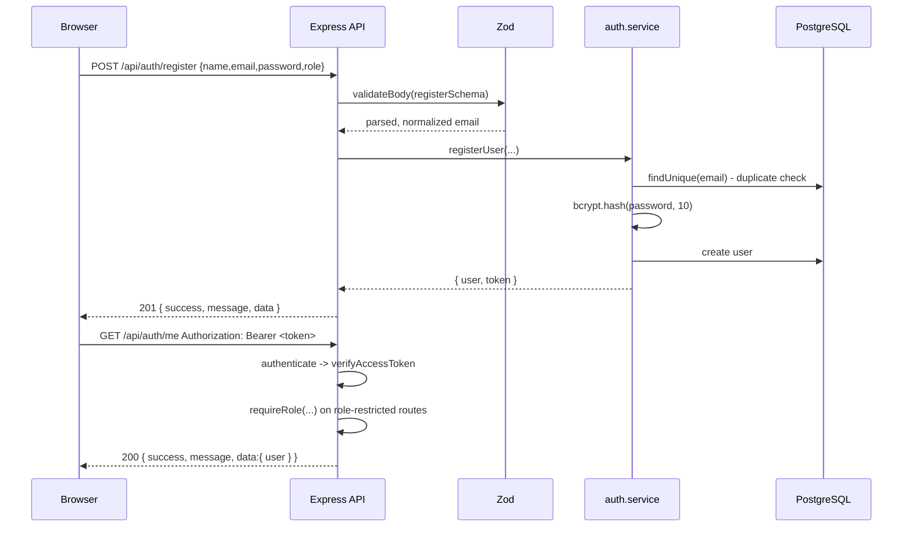
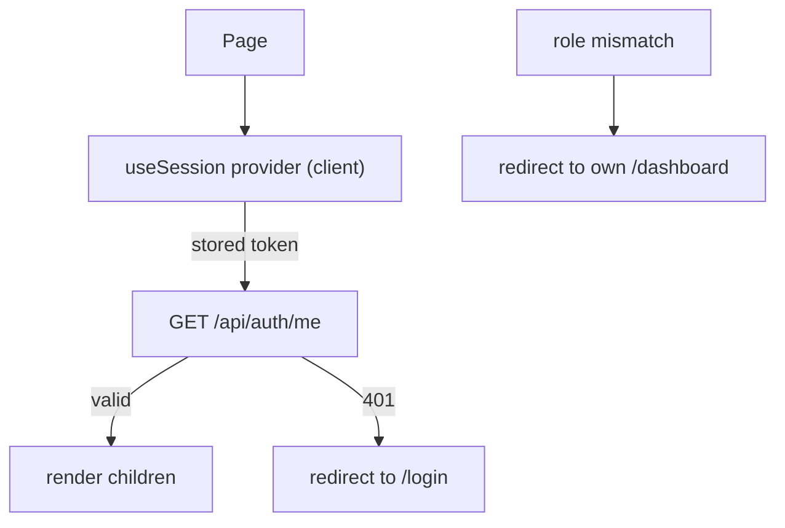
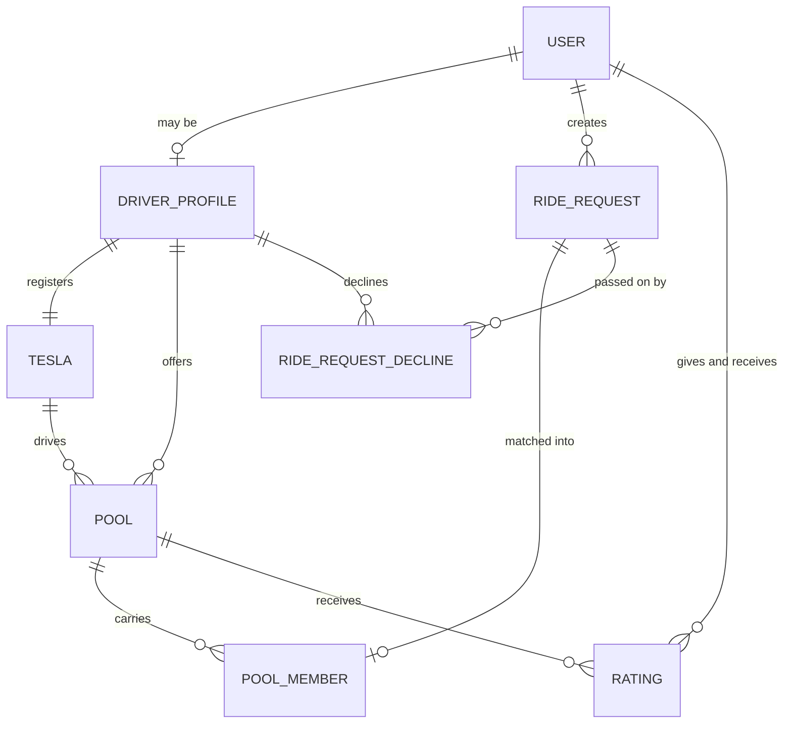

# Architecture

Technical notes for RoBen RidePool. This document describes how the system is
put together today, and where it is going.

## 1. System overview



Request path:

1. The browser loads a page from the Next.js application.
2. The frontend calls the REST API at `NEXT_PUBLIC_API_URL` with the bearer token
   from `localStorage`.
3. The API validates the request, checks the token and the role, runs the business
   rules, and reads or writes data through the Prisma client.
4. PostgreSQL stores the data. It is never exposed to the browser.

A ride being matched, end to end:



## 2. Containers

| Container            | Image            | Port (host) | Responsibility                        |
| -------------------- | ---------------- | ----------- | ------------------------------------- |
| `robenridepool-frontend` | built from `frontend/Dockerfile` | 3000 | Serves the web UI        |
| `robenridepool-backend`  | built from `backend/Dockerfile`  | 5000 | REST API                |
| `robenridepool-postgres` | `postgres:16-alpine`             | 5432 | Persistent data store   |

Startup order is enforced with `depends_on` plus health checks, so the API only
starts once PostgreSQL accepts connections, and the frontend only starts once
the API answers `GET /api/health`.

## 3. Backend layering

```
HTTP request
   -> routes/        URL mapping only
   -> controllers/   request parsing, response shaping
   -> services/      business rules, Prisma data access
   -> PostgreSQL
```

Errors travel the other way: a service throws `AppError`, the centralized
handler in `src/middleware/error.middleware.js` turns it into
`{ "success": false, "message": ... }` with the right HTTP status code. Because
the project uses Express 5, rejected promises from async handlers reach that
middleware automatically - no wrapper function is needed.

Decisions worth keeping:

- The API is stateless, so it can be scaled horizontally without extra work.
- `helmet` sets safe HTTP headers, `morgan` provides request logging, and CORS
  is restricted to the origins listed in `CORS_ORIGIN`.
- Only `src/services` imports Prisma, which keeps SQL out of the HTTP layer.
- Shared rules live in one place. `src/validators/departureWindow.validator.js`
  defines the departure-window rules once and both the pool and the ride-request
  schemas use it, so the two cannot drift apart.

## 3.1 Authentication

Authentication is a stateless JWT flow. The API never stores a session, which
keeps it horizontally scalable and removes the need for a shared cache such as
Redis.



Layer responsibilities:

| Layer                    | Authentication responsibility                                              |
| ------------------------ | ------------------------------------------------------------------------- |
| `routes/auth.routes.js`  | Maps the three URLs and orders the middleware. No logic.                   |
| `validators/`            | Zod schemas. The role enum is imported from Prisma, so the API cannot accept a role the database does not know. |
| `middleware/validate`    | Runs the schema, replaces `req.body` with parsed data, converts issues into a 400 with `details`. |
| `middleware/auth`        | `authenticate` verifies the bearer token and attaches `req.user = { id, role }`. |
| `middleware/role`        | `requireRole(...roles)` returns 403 when the role does not match.          |
| `services/auth.service`  | Duplicate-email check, bcrypt hashing and comparison, token signing, and the safe-user projection. |
| `utils/jwt`              | Wraps `jsonwebtoken` so the payload shape and the 1h expiry live in one place. |

The safe-user projection in the service is a deliberate boundary: even if a
future query selects every column, `passwordHash` cannot escape the service
layer.

Auth middleware is reusable and already used by `/api/auth/me`, so the domain
routes only need one line each:

```js
router.post('/', authenticate, requireRole('DRIVER'), createPool);
```

## 4. Frontend

The frontend is a client-rendered Next.js App Router application. The bearer token
lives in `localStorage`, which does not exist during prerender, so session state is
resolved after hydration rather than by middleware:



`hooks/use-session.js` exports one provider, `useSession` and `Protected`.
`Protected` renders children only after the account is confirmed against the API,
so a stale or tampered cache is never treated as a session. The role redirect is a
convenience only - every API route re-checks the role itself, so the UI guard is
never the thing standing between a passenger and a driver endpoint.

| Route                            | Role      | Purpose                                        |
| -------------------------------- | --------- | ---------------------------------------------- |
| `/dashboard`                     | either    | Sends the account to the page for its role     |
| `/dashboard/passenger`           | Passenger | Request a ride, track it, cancel, rate         |
| `/dashboard/driver`              | Driver    | Onboard, availability, open and list pools     |
| `/dashboard/driver/rides`        | Driver    | Queue: accept into a pool, or decline          |
| `/dashboard/driver/pools/[poolId]` | Driver   | Pool seats, members, start/complete, rate      |

Write actions always refetch from the API rather than patching local state. The
transitions belong to the server, and a client-side guess would have to duplicate
every rule the service enforces. Where the UI can save a wasted call - the queue
marking a request incompatible with the selected pool - it does, but the call is
still made on the server's verdict.

---

## 4.1 Matching model

A ride is a departure window and a pool is a departure window. Compatibility is a
half-open interval overlap, `a.from < b.to && b.from < a.to`, evaluated on instants
rather than wall-clock strings.

This is the only compatibility rule. It is applied at accept time, in the service,
and is not pre-filtered out of the queue - an incompatible request is refused with
**409** and a message naming both windows.

A decline is a separate row (`RideRequestDecline`), not a status change. The
request stays `WAITING` and remains available to other drivers; declining twice by
the same driver is **409** via a unique constraint rather than a read-then-write
check.

## 4.2 Concurrency

Operations that can race on one ride request claim the row inside their
transaction:

| Race                      | Mechanism                                                            | Result |
| ------------------------- | -------------------------------------------------------------------- | ------ |
| Two drivers accept        | conditional `updateMany` on `status: 'WAITING'`                     | exactly one 201 |
| Two accepts, last seat    | capacity re-aggregated with the transaction client                   | one accept |
| Two declines, same driver | unique `(rideRequestId, driverId)`                                   | exactly one 201 |
| Accept vs decline         | decline re-reads under `SELECT ... FOR UPDATE`, the lock accept takes | row and response always agree |

---

## 4.3 Frontend foundations

- Interactivity lives in client components (`components/ui.js`,
  `components/app-shell.js`, the auth form parts and the dashboard pages).
- `lib/api.js` is the single place that knows the API base URL, read from
  `NEXT_PUBLIC_API_URL` and inlined at build time. It also normalizes failures
  into an `ApiError` that carries the server message and field-level details, so
  pages show one message rather than inspecting response shapes.
- `lib/auth-storage.js` wraps `localStorage` access. The MVP accepts
  `localStorage` over an httpOnly cookie for its simpler stateless flow, and
  the trade-off is documented in that file.
- `lib/format.js` owns all display formatting - paisa to a decimal amount,
  instants to local dates and times, windows as a readable range, status enums
  as labels. Formatting happens on the way to the screen only.
- Styling uses Tailwind CSS 4 with the utility-first approach, no component
  library, so the visual language stays consistent and the dependency list
  stays small.

## 5. Data model

`backend/prisma/schema.prisma` holds the whole domain. Two committed migrations
bring a fresh database up: `20260928173811_add_user_model` (users and `Role`) and
`20260930080103_add_pool_departure_window_and_request_declines` (the pool window,
the request window and `RideRequestDecline`).

### ERD



| Model                 | Responsibility                                                    |
| --------------------- | ----------------------------------------------------------------- |
| `User`                | Credentials, role, contact data                                    |
| `DriverProfile`       | Availability, one-to-one with the user who drives                  |
| `Tesla`               | Plate, model, seat capacity - one per driver in the MVP           |
| `RideRequest`         | Origin, destination, departure window, seats, estimated and final fare, status |
| `Pool`                | One driver's departure window, lifecycle and members               |
| `PoolMember`          | Per-passenger seats and fare within a pool                        |
| `RideRequestDecline`  | One driver passing on one request                                 |
| `Rating`              | 1-5 score from one participant to the other after a completed pool |

Design notes:

- `passwordHash` is the only credential column; there is no plaintext field.
- `email` is unique, and the service lower-cases it before writing, so
  uniqueness is effectively case-insensitive without a functional index.
- `role` is a database enum rather than a free string, so an invalid role is
  rejected by PostgreSQL as well as by Zod.
- `DriverProfile` is optional and one-to-one with `User`, so passengers never
  carry driver-only columns.
- **`Pool` is not `Ride`.** The driver sets a departure window and opens the pool
  before anyone joins, so the pool has to exist while it is still empty. That also
  makes the name honest: a pool with three members and one with one are the same
  kind of thing.
- **Per-passenger allocation lives on `PoolMember`**, because two passengers can
  share one Tesla paying different fares. `rideRequestId` is unique there, which
  is what enforces "a request belongs to at most one pool" - a rule Prisma cannot
  state directly, and which the service also claims transactionally.
- **A decline is a row, not a status.** `RideRequestStatus` has no `DECLINED`
  member, because declining is a fact about one driver while `status` describes
  the request. See [Accept and decline](README.md#accept-and-decline) in the
  README.
- **`Rating` is about the `Pool`, and both sides are `User`s.** A driver is
  already a `User` via `DriverProfile.userId`, so one pair of user foreign keys
  expresses "passenger scores driver" and "driver scores passenger" without a
  polymorphic column. `@@unique([poolId, raterId])` stops double scoring.
- Money is integer paisa throughout, so no floating point rounding can reach a
  fare.

### Timestamps

Every `DateTime` column is `TIMESTAMP(3)` **without** time zone, and every value
stored in one is a UTC instant. Clients must send ISO 8601 with an explicit
offset, which Zod enforces, so the offset is applied once on the way in and never
has to be guessed from a user's locale or a driver's location. The frontend has
one helper, `toApiInstant`, that turns a `datetime-local` input into a UTC ISO
string.

## 6. Security

Current measures: no secrets in the repository, `helmet` headers, an explicit
CORS allow-list, a non-root user in both container images, bcrypt password
hashing, 1 hour JWT expiry, generic login failures with a constant-time dummy
comparison, a Zod layer that strips unknown fields, and an API that refuses to
start without `JWT_SECRET`.

Domain-specific measures:

- **Identity comes from the token.** `req.user.id` is the actor everywhere;
  `driverId`, `raterId` and `rateeId` in request bodies are ignored or refused.
- **Money and seats come from the database.** Accepting takes only a
  `rideRequestId`, and the service reads seats and fare off the request.
- **Status is set by named transitions**, never by a client-supplied value, so
  the rules for each step cannot be skipped.
- **Responses use explicit projections** rather than spreading Prisma records, so
  adding a sensitive column later cannot leak it through an existing endpoint.
  `passwordHash` and other passengers' emails never appear in driver-facing
  responses.
- **Foreign rows are reported as not found.** A pool belonging to another driver
  and a pool that does not exist return the same 404, so the endpoint does not
  confirm that an id exists.
- **Ownership is checked before every read**, not only before writes.

## 7. Verification

| Check                 | Command                              | Covers                                        |
| --------------------- | ------------------------------------ | --------------------------------------------- |
| Backend suite         | `cd backend && npm test`             | 417 tests, integration against PostgreSQL      |
| End-to-end walkthrough| `cd backend && node scripts/e2e-mvp.mjs` | 41 cross-role steps against a running API   |
| Frontend build        | `cd frontend && npm run build`       | ESLint first, then compiles and prerenders all routes |

The walkthrough needs the API running (`npm run dev` or `npm start` in
`backend/`) and a reachable development database; it creates its own accounts
with a unique suffix each run, so it is repeatable but not self-cleaning.

### Why the frontend has a linter

Everything else in this table is server-side, so none of it can see a React
render. A `useCallback(fn, [user])` in a component that destructured only
`{ token }` shipped once: `user is not defined` threw during render and blanked
the passenger page, with the build green and all 458 server-side checks passing.
`no-undef`, run before `next build`, is the gate for that class.

## 8. Not yet done

Rate limiting on the auth endpoints, an httpOnly cookie instead of
`localStorage`, refresh tokens, email verification, server-side filtering of the
driver queue, and frontend component tests. See
[Current limitations](README.md#current-limitations) in the README for the full
list with reasons.
