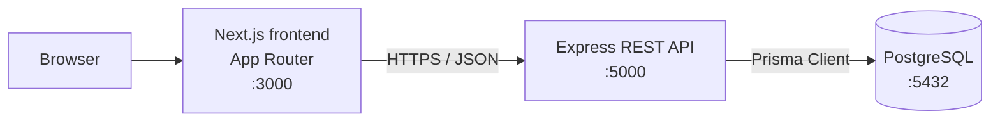
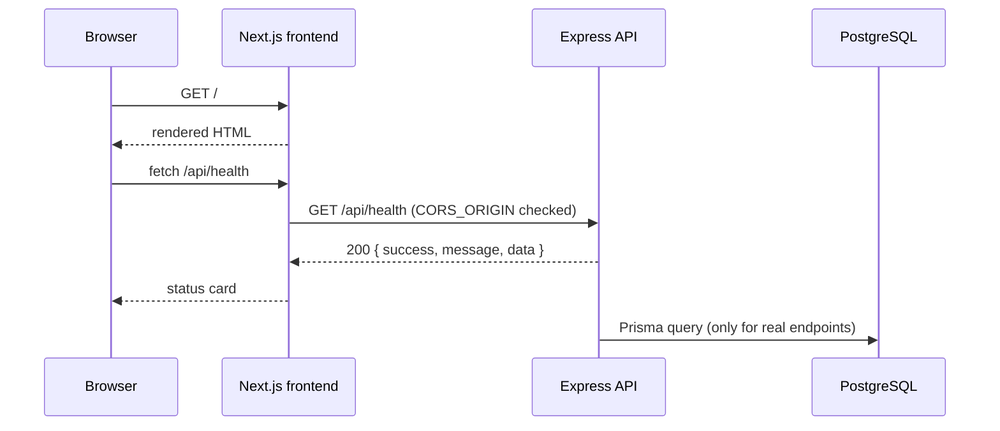
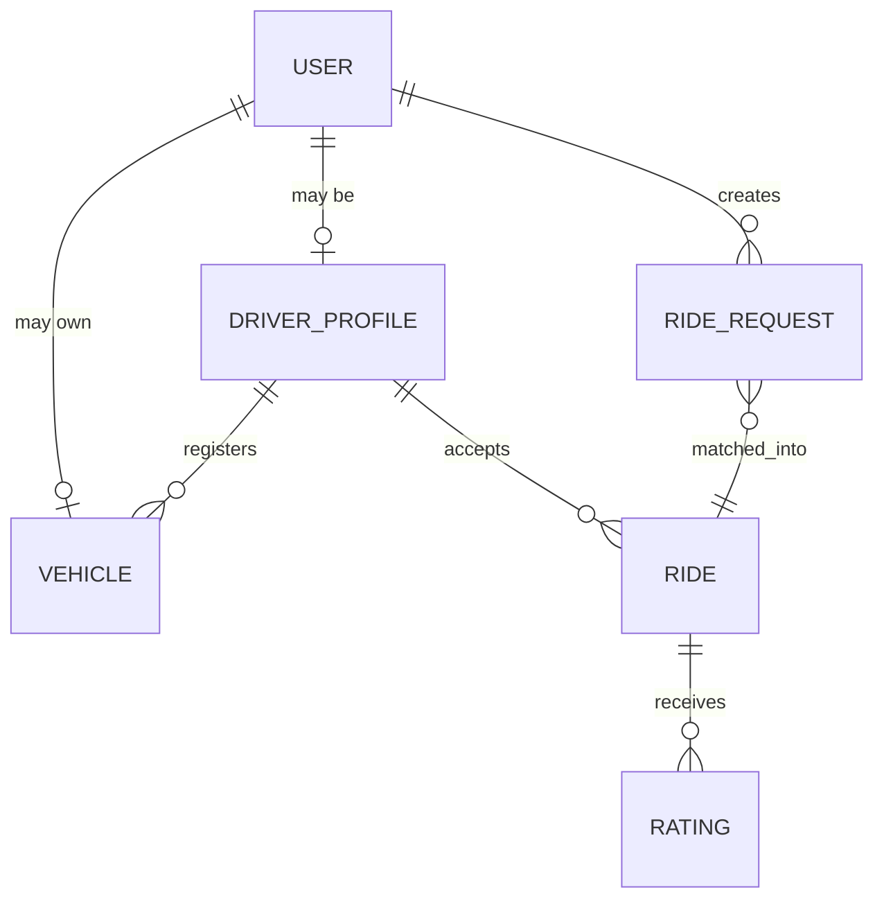

# Architecture

Technical notes for RoBen RidePool. This document describes how the system is
put together today, and where it is going.

## 1. System overview



Request path:

1. The browser loads a page from the Next.js application.
2. The frontend calls the REST API at `NEXT_PUBLIC_API_URL` (browser to
   container:5000 during local development and Docker).
3. The API validates the request, runs the business rules, and reads or writes
   data through the Prisma client.
4. PostgreSQL stores the data. It is never exposed to the browser.



## 2. Containers

| Container            | Image            | Port (host) | Responsibility                        |
| -------------------- | ---------------- | ----------- | ------------------------------------- |
| `robenridepool-frontend` | built from `frontend/Dockerfile` | 3000 | Serves the web UI        |
| `robenridepool-backend`  | built from `backend/Dockerfile`  | 5000 | REST API                |
| `robenridepool-postgres` | `postgres:16-alpine`             | 5432 | Persistent data store   |

Startup order is enforced with `depends_on` plus health checks, so the API only
starts once PostgreSQL accepts connections, and the frontend only starts once
the API answers `GET /api/health`.

## 3. Backend layering

```
HTTP request
   -> routes/        URL mapping only
   -> controllers/   request parsing, response shaping
   -> services/      business rules, Prisma data access
   -> PostgreSQL
```

Errors travel the other way: a service throws `AppError`, the centralized
handler in `src/middleware/error.middleware.js` turns it into
`{ "success": false, "message": ... }` with the right HTTP status code. Because
the project uses Express 5, rejected promises from async handlers reach that
middleware automatically - no wrapper function is needed.

Decisions worth keeping:

- The API is stateless, so it can be scaled horizontally without extra work.
- `helmet` sets safe HTTP headers, `morgan` provides request logging, and CORS
  is restricted to the origins listed in `CORS_ORIGIN`.
- Only `src/services` imports Prisma, which keeps SQL out of the HTTP layer.

## 4. Frontend

- Next.js App Router with server components by default; interactivity is added
  through client components (`components/api-status-card.js`).
- `lib/api.js` is the single place that knows the API base URL. It is read from
  `NEXT_PUBLIC_API_URL` and inlined at build time.
- Styling uses Tailwind CSS 4 with the utility-first approach, no component
  library, so the visual language stays consistent and the dependency list
  stays small.

## 5. Data model

### Current state

`backend/prisma/schema.prisma` only declares the PostgreSQL connection. There
are no models yet on purpose - each model is added together with the feature
that needs it, and every change ships as a checked-in migration.

```prisma
datasource db {
  provider = "postgresql"
  url      = env("DATABASE_URL")
}
```

### ERD (placeholder)

The entity-relationship model will be filled in here as soon as the first
migration exists. The intended shape:



Planned entities and their responsibilities:

| Entity          | Responsibility                                                    |
| --------------- | ----------------------------------------------------------------- |
| `User`          | Credentials, role (`PASSENGER` / `DRIVER` / `ADMIN`), contact data |
| `DriverProfile` | Availability, capacity, rating aggregates, licence data            |
| `Vehicle`       | Plate, model, capacity, driver ownership                           |
| `RideRequest`   | Origin, destination, departure window, desired capacity            |
| `Ride`          | Confirmed shared trip, status, seats taken, agreed fare            |
| `Rating`        | 1-5 score from one party to the other after a completed ride       |

Key relationships to design carefully when the schema is written:

- One passenger request can become at most one ride; a ride can be joined by
  several passengers, which is what makes it a *pool*.
- A driver has one active ride at a time, enforced in the service layer
  (Prisma cannot express it as a constraint).
- Ratings are unique per `(ride, rater)`.

## 6. Security

Current measures: no secrets in the repository, `helmet` headers, an explicit
CORS allow-list, and a non-root user in both container images.

Before the first public deployment the project also needs input validation
(Zod) on every mutating route, rate limiting on auth endpoints, and a real
`JWT_SECRET` supplied by the environment.
