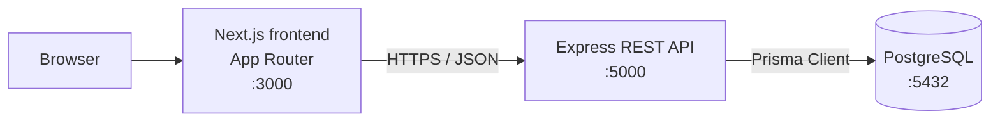
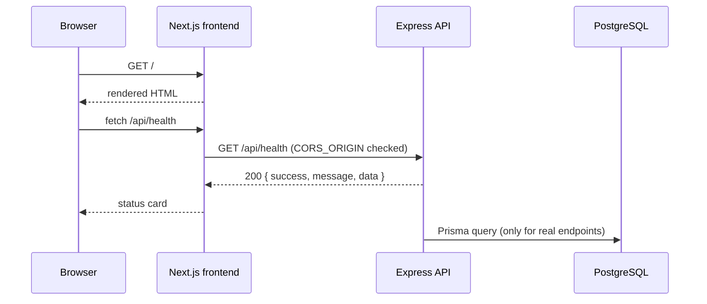
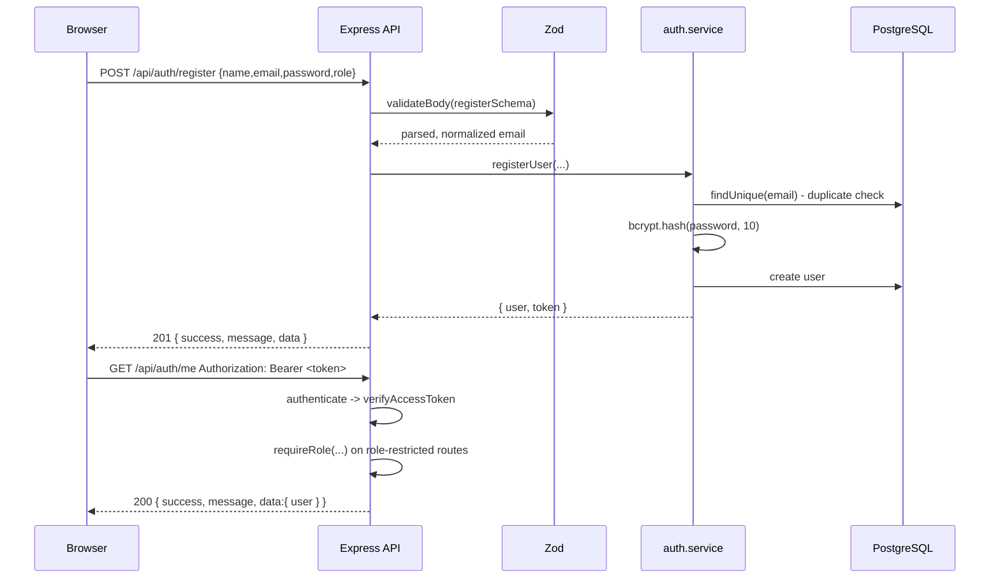
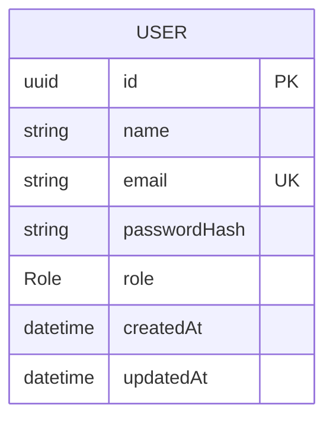
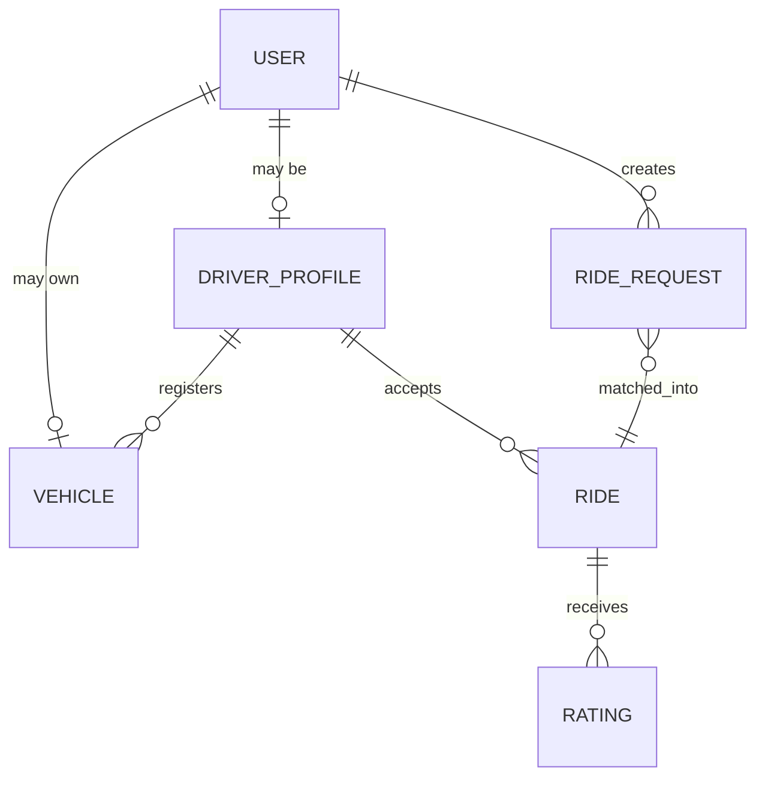

# Architecture

Technical notes for RoBen RidePool. This document describes how the system is
put together today, and where it is going.

## 1. System overview



Request path:

1. The browser loads a page from the Next.js application.
2. The frontend calls the REST API at `NEXT_PUBLIC_API_URL` (browser to
   container:5000 during local development and Docker).
3. The API validates the request, runs the business rules, and reads or writes
   data through the Prisma client.
4. PostgreSQL stores the data. It is never exposed to the browser.



## 2. Containers

| Container            | Image            | Port (host) | Responsibility                        |
| -------------------- | ---------------- | ----------- | ------------------------------------- |
| `robenridepool-frontend` | built from `frontend/Dockerfile` | 3000 | Serves the web UI        |
| `robenridepool-backend`  | built from `backend/Dockerfile`  | 5000 | REST API                |
| `robenridepool-postgres` | `postgres:16-alpine`             | 5432 | Persistent data store   |

Startup order is enforced with `depends_on` plus health checks, so the API only
starts once PostgreSQL accepts connections, and the frontend only starts once
the API answers `GET /api/health`.

## 3. Backend layering

```
HTTP request
   -> routes/        URL mapping only
   -> controllers/   request parsing, response shaping
   -> services/      business rules, Prisma data access
   -> PostgreSQL
```

Errors travel the other way: a service throws `AppError`, the centralized
handler in `src/middleware/error.middleware.js` turns it into
`{ "success": false, "message": ... }` with the right HTTP status code. Because
the project uses Express 5, rejected promises from async handlers reach that
middleware automatically - no wrapper function is needed.

Decisions worth keeping:

- The API is stateless, so it can be scaled horizontally without extra work.
- `helmet` sets safe HTTP headers, `morgan` provides request logging, and CORS
  is restricted to the origins listed in `CORS_ORIGIN`.
- Only `src/services` imports Prisma, which keeps SQL out of the HTTP layer.

## 3.1 Authentication

Authentication is a stateless JWT flow. The API never stores a session, which
keeps it horizontally scalable and removes the need for a shared cache such as
Redis.



Layer responsibilities:

| Layer                    | Authentication responsibility                                              |
| ------------------------ | ------------------------------------------------------------------------- |
| `routes/auth.routes.js`  | Maps the three URLs and orders the middleware. No logic.                   |
| `validators/`            | Zod schemas. The role enum is imported from Prisma, so the API cannot accept a role the database does not know. |
| `middleware/validate`    | Runs the schema, replaces `req.body` with parsed data, converts issues into a 400 with `details`. |
| `middleware/auth`        | `authenticate` verifies the bearer token and attaches `req.user = { id, role }`. |
| `middleware/role`        | `requireRole(...roles)` returns 403 when the role does not match.          |
| `services/auth.service`  | Duplicate-email check, bcrypt hashing and comparison, token signing, and the safe-user projection. |
| `utils/jwt`              | Wraps `jsonwebtoken` so the payload shape and the 1h expiry live in one place. |

The safe-user projection in the service is a deliberate boundary: even if a
future query selects every column, `passwordHash` cannot escape the service
layer.

Auth middleware is reusable and already used by `/api/auth/me`, so the future
ride endpoints only need one line:

```js
router.post('/rides', authenticate, requireRole('PASSENGER'), createRide);
```

## 4. Frontend

- Next.js App Router with server components by default; interactivity is added
  through client components (`components/api-status-card.js`,
  `components/session-card.js`, the auth forms).
- `lib/api.js` is the single place that knows the API base URL. It is read from
  `NEXT_PUBLIC_API_URL` and inlined at build time. It also normalizes failures
  into an `ApiError` that carries the server message and field-level details.
- `lib/auth-storage.js` wraps `localStorage` access. The MVP accepts
  `localStorage` over an httpOnly cookie for its simpler stateless flow, and
  the trade-off is documented in that file.
- Styling uses Tailwind CSS 4 with the utility-first approach, no component
  library, so the visual language stays consistent and the dependency list
  stays small.

## 5. Data model

### Current state

`backend/prisma/schema.prisma` contains the authentication domain: the `Role`
enum and the `User` model. The committed migration
`prisma/migrations/20260928173811_add_user_model` creates the `Role` type, the
`users` table and the unique index on `email`.

```prisma
enum Role {
  PASSENGER
  DRIVER
}

model User {
  id           String   @id @default(uuid())
  name         String
  email        String   @unique
  passwordHash String
  role         Role
  createdAt    DateTime @default(now())
  updatedAt    DateTime @updatedAt
  @@map("users")
}
```

Design notes:

- `passwordHash` is the only credential column; there is no plaintext field.
- `email` is unique, and the service lower-cases it before writing, so
  uniqueness is effectively case-insensitive without a functional index.
- `role` is a database enum rather than a free string, so an invalid role is
  rejected by PostgreSQL as well as by Zod.
- `DriverProfile` is intentionally **not** modelled yet. It can be a one-to-one
  relation from `User` for passengers who never drive, which keeps the driver
  tables small.

### ERD (current)



### ERD (target)

The remaining entities arrive with the ride-pooling features:



Planned entities and their responsibilities:

| Entity           | Responsibility                                                    |
| ---------------- | ----------------------------------------------------------------- |
| `User`           | Credentials, role (`PASSENGER` / `DRIVER`), contact data - done   |
| `DriverProfile`  | Availability, capacity, rating aggregates, licence data            |
| `Vehicle`        | Plate, model, capacity, driver ownership                           |
| `RideRequest`    | Origin, destination, departure window, desired capacity            |
| `Ride`           | Confirmed shared trip, status, seats taken, agreed fare            |
| `Rating`         | 1-5 score from one party to the other after a completed ride       |

Key relationships to design carefully when the schema is written:

- One passenger request can become at most one ride; a ride can be joined by
  several passengers, which is what makes it a *pool*.
- A driver has one active ride at a time, enforced in the service layer
  (Prisma cannot express it as a constraint).
- Ratings are unique per `(ride, rater)`.

## 6. Security

Current measures: no secrets in the repository, `helmet` headers, an explicit
CORS allow-list, a non-root user in both container images, bcrypt password
hashing, 1 hour JWT expiry, generic login failures with a constant-time dummy
comparison, a Zod layer that strips unknown fields, and an API that refuses to
start without `JWT_SECRET`.

Before the first public deployment the project also needs rate limiting on the
auth endpoints, an httpOnly cookie instead of `localStorage`, refresh tokens,
and email verification.
